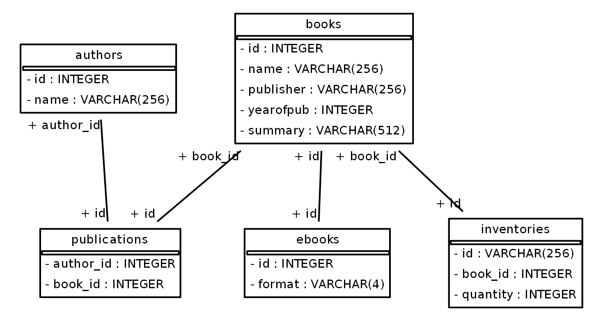

# BookComet S.I.
Book-Comet Storage Interface, for books!

This is a toy API for handling book storage. Intended to be used for code demonstration purposes.

See [kgfelix](https://github.com/kgfelix/book-comet-coding-challenge) original design and requirements, of which this project attempts to implement.


## Installation

Check our dependencies [file](/requirements.txt) and [section](#dependencies) for details.

You can use pip:
```bash
pip install -r requirements.txt
pip3 install -r requirements.txt
```

## Usage
Start server:
```bash
uvicorn run:app
```
Run tests:
```bash
python -m unittest discover App/Tests -p "*.py"
python3 -m unittest discover App/Tests -p "*.py"

# verbose example;
python -m unittest discover App -p "*.py" -s "App/Tests" -v
```

## <span id="dependencies"> Dependencies </span>
* SqlAlchemy → ORM object to sql mapper:
    * SchemaDisplay lib → schema [visualization](#schema-view);

* Pandas → used for migrating .csv data into MySQL;
* FastAPI → used for routing, HTTP request handling, web & much more;
* pydantic → used by FastAPI to implement typed forms;
* uvicorn → used for hosting the application;

## Structure

### Tools
- Python 3.9.7
- MySQL 8

### Relational Database: MySQL
The original projects, settles for two entities. But in the relational database context, an association table is mandatory, and it introduce secondary entities such as "publications".

A similar approach is used for eBooks requirement, where it inherits book attributes through a foreign key. In code an Interface is used to better abstract the inheritance.

Since Books can have multiple authors, author becomes an entity by itself.

*note: relational databases were not a project requirement, but the author found it interesting for displaying agile implementations.*



<figcaption align="center"><b>Fig.1 - Final database schema;</b></figcaption>

---
## License
[GNU 3.0](/LICENSE)